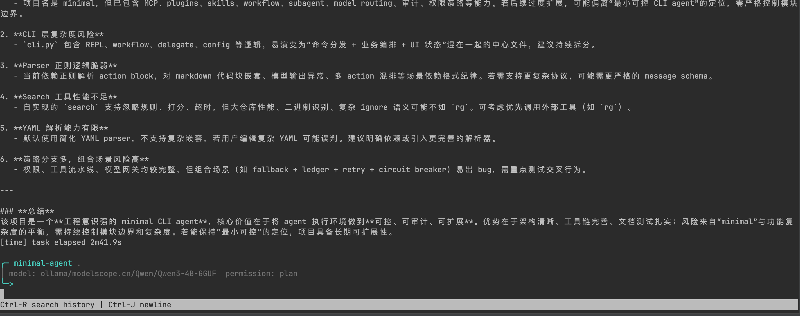

# minimal-cli-agent

语言：[English](README.md) | 中文

一个受 [Minimal AI agent tutorial](https://minimal-agent.com/) 启发的极简 CLI Agent。它实现了文章里的核心循环：让模型输出一个 action，解析 action，在终端环境里执行，再把 observation 追加回上下文，持续循环。

项目刻意从小处开始，但代码按可替换模块拆分，后续可以演进到 sub-agent、group session、memory、权限、skills、MCP、plugins 和 workflow 委托。



## 当前能力

- 作为终端 CLI 运行。
- 支持 `--interactive` 多轮交互会话；不传 task 时也会进入同一个 REPL。
- 支持 slash commands，在运行时切换 profile/model/permission/context/plan/review。
- 支持通过 `--mcp-config` 接入 HTTP MCP server，并把 MCP 工具注册到同一个 `ToolRegistry`。
- 支持通过 `--skill` 加载本地 instruction skill，包括已安装的瑞幸咖啡 `my-coffee` skill。
- 默认支持本地 Ollama chat 模型。
- 支持 Ollama、Codex CLI 登录态、Claude/Anthropic、Gemini profile。
- 支持直接指定 OpenAI-compatible `/chat/completions` 接口。
- 单轮可解析一个或多个 action，支持 shell 或文件工具 action：

````text
```bash-action
ls -la
```

```tool-action
{"tool":"read_file","path":"README.md"}
```

```tool-action
{"tool":"read_tail","path":"README.md","lines":80}
```

```tool-action
{"tool":"read_forward","path":"README.md","offset":0,"limit":8192}
```

```tool-action
{"tool":"search","pattern":"permission","path":".","top_k":20,"timeout_ms":2000,"ignore_dirs":["dist"],"include_extensions":[".py"]}
```

```tool-action
{"tool":"write_file","path":"notes/todo.txt","content":"hello"}
```

```tool-action
{"tool":"edit_file","path":"notes/todo.txt","start_line":2,"end_line":3,"content":"replacement"}
```
````

- 执行命令时带超时控制和非交互环境变量。
- 通过结构化工具读取、分页读取、读取尾部、搜索和写入工作区文件，不强迫模型用 shell 操作文件。
- 支持 `edit_file` 做 1-based 行号范围增量替换，不需要让模型重写整个文件。
- 文件工具环境会串行化同文件写入。
- 搜索支持 `top_k`、`max_files`、`timeout_ms`、额外 `ignore_dirs` 和 `include_extensions`。
- 搜索会读取工作区 `.gitignore` 和 `.agentignore`，支持常见目录和 glob 忽略模式。
- `write_file` 或 `edit_file` 写入 JSON、TOML、XML 前会先校验格式；YAML 在安装 PyYAML 时也会校验。
- 会从命令 observation 中清洗常见 API key、bearer token 和疑似密钥值。
- 默认阻止明显的网络 shell 命令，除非显式传入 `--allow-network`。
- 支持通过 `--policy-file` 配置 shell allow 前缀、追加 deny 规则和工作区写入范围。
- 支持产品化权限模式：`default`、`autoEdit`、`plan`、`yolo`。
- 传入 `--session` 时，可以把最近 session messages、active plan 和权限审计事件持久化到 JSON，并使用 lock 文件和原子替换写入。
- transcript 变大时，会应用一个简单的本地上下文压缩保护。
- 可以通过 `--summarize-context` 使用模型生成旧上下文摘要。
- 暴露无状态 API：`Agent.chat_stream(message, context)`，以事件流形式产出 loop event。
- 工具发现和参数校验失败时返回可恢复 observation，而不是直接把原始异常抛给用户。
- 未知工具会返回安全的相近工具名建议，但不会自动猜测并执行。
- 工具参数校验会对结构化 payload 返回字段级 repair observation。
- 工具管道 decision hooks 可以在确认前仲裁 `allow` / `ask` / `deny` / `skip` 决策。
- 工具 observation 统一包含 `status`、`exit_code`、`command` 和 `output`。
- Agent loop 运行在 `AgentHarness` 边界后面，tools、memory、policy、context、environment 可以独立演进。

## 为什么这样开始

参考文章的关键观点是：一个有用的 CLI Agent 一开始不需要很大的框架。最小循环已经足够产生真实行为：

1. 保存 messages。
2. 请求语言模型。
3. 解析模型要求的 action。
4. 执行 action。
5. 把命令输出作为 observation 返回给模型。

这个仓库把循环保留在 `src/minimal_cli_agent/agent.py`，同时把 model、parser、environment、memory、policy、tool pipeline 拆开，方便后续替换。

## 安装

```bash
python3 -m venv .venv
source .venv/bin/activate
pip install -e .
```

项目已包含 `httpx[socks]`，模型请求可以读取 `http_proxy`、`https_proxy`、`all_proxy` 中的 SOCKS 代理配置。

## 使用 Ollama 运行

```bash
ollama pull qwen3:4b
ollama serve
minimal-agent --permission default "List the files in this project, then exit"
```

等价的 module 方式：

```bash
python -m minimal_cli_agent.cli --permission default "List the files in this project, then exit"
```

## 只规划不执行命令

```bash
minimal-agent --permission plan "Inspect this repository structure"
```

## 多轮交互会话

启动一个多轮 CLI 会话：

```bash
minimal-agent --profile codex --permission plan --interactive
```

也可以先传入第一句话，然后继续对话：

```bash
minimal-agent --profile codex --permission plan --interactive "Analyze this project"
```

输入 `/help` 查看交互命令。输入 `/` 会快速展示常用命令；输入 `/exit`、`/quit`、`exit` 或 `quit` 退出。如果传入 `--session path/to/session.json`，每轮结束后会保存 messages，下次运行时继续加载。

在交互模式下，普通对话可以直接自然语言回复；只有需要查看文件、修改文件或运行命令时，模型才需要输出 action block。

交互模式默认压缩工具过程输出：终端只显示工具名、目标路径或命令摘要、状态和输出大小，不直接倾倒完整文件内容。完整 observation 仍会保留在 agent context 里给模型使用。

如果希望 loop 能直接修改项目文件，使用 `--permission autoEdit`，这样文件写入类工具不会每次询问。`plan` 仍然是只读模式：可以读文件，但会跳过 shell 命令和文件写入。

如果某轮在 `plan` 模式下走到了必须写文件的步骤，REPL 会询问是否切到 `autoEdit` 并自动重试同一条用户输入，不需要重新输入任务。

大部分启动参数也可以在 REPL 内切换：

```text
/config
/profile codex
/provider ollama
/model qwen3:4b
/base-url http://localhost:11434
/permission autoEdit
/network on
/summarize on
/mcp examples/mcp/my-coffee.json
/skill my-coffee
/context status
/context compact
/context clear
/plan improve test coverage
/plan show
/plan clear
/review src/minimal_cli_agent
```

`/plan <goal>` 会用 `plan` 权限运行一次隔离的计划 turn，保存 typed plan artifact，并且不会把计划阶段 transcript 合并进当前聊天上下文。传入 `--session` 时，active plan 会和 messages、审计事件一起持久化。

`/review [path]` 会通过同一个 agent loop 发起 review turn，所以它可以用 `read_file` 检查文件，并遵守当前 permission mode。

## MCP 和 Skills

MCP server 从 JSON 配置文件加载。CLI 直接兼容 Codex、Claude 等 MCP 客户端常见的 `mcpServers` 结构：

```json
{
  "mcpServers": {
    "my-coffee": {
      "type": "streamablehttp",
      "url": "https://gwmcp.lkcoffee.com/order/user/mcp",
      "headers": {
        "Authorization": "Bearer ${LUCKIN_MCP_TOKEN}"
      }
    }
  }
}
```

瑞幸配置样例位于 `examples/mcp/my-coffee.json`。下载的技能已安装到 `skills/my-coffee/SKILL.md`。

运行方式：

```bash
export LUCKIN_MCP_TOKEN="<登录后复制的 token>"
minimal-agent \
  --profile codex \
  --permission default \
  --mcp-config examples/mcp/my-coffee.json \
  --skill my-coffee \
  --interactive
```

在 REPL 里也可以不重启直接加载或切换：

```text
/mcp examples/mcp/my-coffee.json
/skill my-coffee
```

每个 MCP server 都会固定注册两个通用工具：

```tool-action
{"tool":"mcp_my_coffee_list_tools"}
```

```tool-action
{"tool":"mcp_my_coffee_call_tool","name":"queryShopList","arguments":{}}
```

如果启动时 `tools/list` 成功，Harness 还会注册远端工具快捷名，例如 `mcp_my_coffee_queryshoplist`。
为了避免启动 CLI 时被网络或 token 问题拖住，默认不会启动远端发现。如果希望启动时 best-effort 注册具体工具快捷名，可以在对应 server 配置里加入 `"discoverTools": true`。

后续复用到其它 MCP provider 的流程：

1. 把 provider 配置放到 `examples/mcp/<name>.json` 或任意本地路径。
2. 把 instruction skill 放到 `skills/<name>/SKILL.md`，或者用 `--skill` 传入直接路径。
3. 启动 CLI 时传入 `--mcp-config <path> --skill <name>`。
4. 交互模式下可以用 `/mcp` 和 `/skill` 在同一个 session 中切换。

## OpenAI-Compatible 接口

```bash
AGENT_PROVIDER=openai-compatible \
AGENT_BASE_URL=https://api.openai.com/v1 \
AGENT_API_KEY=... \
AGENT_MODEL=gpt-4.1-mini \
minimal-agent --permission default "Check the tests and summarize failures"
```

## Profiles

可以用 `--profile` 读取常见 CLI 模型工具的默认本地配置：

```bash
minimal-agent --profile ollama "List files, then exit"
minimal-agent --profile codex "List files, then exit"
minimal-agent --profile claude "List files, then exit"
minimal-agent --profile gemini "List files, then exit"
```

Profile 行为：

- `ollama`：读取 `OLLAMA_MODEL` 和 `OLLAMA_BASE_URL`，默认走本地 Ollama。
- `codex`：读取 `~/.codex/config.toml` 里的模型。如果显式设置了 `OPENAI_API_KEY` 或 `OPENAI_BASE_URL`，则使用 OpenAI-compatible provider。否则当 `~/.codex/auth.json` 包含 Codex 登录态 `tokens.access_token` 时，会使用本机 Codex CLI 作为请求适配器，不会把这个 token 发到 `api.openai.com`。
- `claude`：读取 `~/.claude/settings.json` 里的 model 和 Anthropic proxy env，同时支持 `ANTHROPIC_API_KEY` / `ANTHROPIC_AUTH_TOKEN`。
- `gemini`：读取 `GEMINI_MODEL`、`GEMINI_BASE_URL`、`GEMINI_API_KEY` 或 `GOOGLE_API_KEY`。

显式传入的 CLI 参数优先级最高，例如 `--model`、`--base-url`、`--api-key` 会覆盖 profile 专属环境变量或配置文件。

## CLI 参数

```text
--provider       ollama、openai-compatible、anthropic、gemini 或 codex
--profile        ollama、codex、claude 或 gemini
--model          模型名称
--base-url       provider base URL
--api-key        OpenAI-compatible 接口的 API key
--cwd            命令执行目录
--max-steps      Agent loop 最大迭代次数
--timeout        命令超时时间，单位秒
--shell          shell adapter：system、bash、zsh、sh、powershell、cmd、git-bash 或 shell command
--model-timeout  模型请求超时时间，单位秒
--model-fallback JSON fallback 路由，可重复传入
--model-max-retries 每个模型路由的重试次数
--model-max-concurrency 每个路由允许的并发模型调用数
--usage-ledger   JSONL 模型用量账本路径
--usage-subject  用量计量的用户或账号 key
--usage-tenant   用量计量的租户 key
--max-input-tokens / --max-output-tokens / --max-request-tokens
--daily-token-limit / --monthly-token-limit
--max-request-cost / --daily-cost-limit / --monthly-cost-limit
--model-price-input-per-1m / --model-price-output-per-1m
--allow-network  允许明显会访问网络的 shell 命令
--policy-file    包含 shell policy allow/deny 和写入范围规则的 JSON 文件
--mcp-config     包含 MCP servers 的 JSON 配置文件
--skill          skills/<name> 下的技能名，或直接传入 SKILL.md 路径
--summarize-context 使用模型总结旧上下文
--interactive    启动多轮交互 CLI 会话
--permission     default、autoEdit、plan 或 yolo
--session        用于持久化 messages 的 JSON 文件
```

Fallback 路由使用 JSON 对象，避免 URL 和模型名里的冒号需要额外转义：

```bash
minimal-agent "总结这个仓库" \
  --provider openai-compatible \
  --model primary-model \
  --base-url https://api.example.com/v1 \
  --model-price-input-per-1m 2.00 \
  --model-price-output-per-1m 8.00 \
  --model-fallback '{"provider":"ollama","model":"qwen3:4b","base_url":"http://localhost:11434","timeout":30}' \
  --usage-ledger .agent/usage.jsonl \
  --daily-cost-limit 5.00
```

模型网关会记录估算 token、估算费用、延迟、状态、prompt 版本、subject、tenant、provider 和 model。限额会在请求发出前检查；失败尝试会记录到账本，但默认不计费，除非启用 `--bill-failed-requests`。

## 项目结构

Policy 文件可以追加 allow/deny 规则，但不会削弱内置 hard gate：

```json
{
  "allow_command_prefixes": ["printf "],
  "deny_command_tokens": ["custom-danger"],
  "write_allow_paths": ["src/**", "tests/**"],
  "write_deny_paths": ["src/**/secrets*.py"],
  "sensitive_path_tokens": ["secrets.local"],
  "network_command_tokens": ["my-net-tool "]
}
```

使用 `--profile codex` 时，Codex CLI 只作为模型适配器使用。它会被提示只返回下一条 assistant message；如果需要操作工作区，应输出 `bash-action` 或 `tool-action`，仍由 minimal-agent loop 负责执行命令和修改文件。如果适配器耗时较长，可以调大 `--model-timeout`。

```text
src/minimal_cli_agent/
  agent.py         控制循环，无状态 chat/chat_stream 入口
  harness.py       model、tools、memory、context、policy 的运行时边界
  interfaces.py    扩展点协议
  tool_registry.py 工具注册与发现边界
  tool_pipeline.py 分阶段工具执行管道
  policy.py        shell 权限策略
  context.py       上下文准备边界
  file_tools.py    工作区 read_file、read_tail、read_forward、search、write_file 和 edit_file 工具
  mcp_tools.py     streamable HTTP MCP 配置加载与工具适配器
  skills.py        本地 SKILL.md 解析与 prompt 注入
  model_gateway.py 模型路由、fallback、重试、熔断、限额和用量账本
  model.py         Ollama、OpenAI-compatible、Anthropic、Gemini HTTP client 和 Codex CLI adapter
  parser.py        bash-action 和 tool-action 解析器
  environment.py   shell adapter 和本地命令执行
  memory.py        JSON session store 和基础上下文压缩
  prompts.py       system prompt 和格式提醒
```

## 扩展计划

更完整的架构说明见 [docs/architecture.md](docs/architecture.md)。
更细的 harness 差距分析和路线图见 [docs/harness-gap-analysis.zh-CN.md](docs/harness-gap-analysis.zh-CN.md)。

- 基于模型总结的上下文压缩。
- explorer、worker、verifier 等 SubAgent。
- 多 Agent 协同的 GroupSession。
- 分层 memory 管理。
- 带审计记录的安全和权限策略。
- Skill、MCP 和 plugin 注册。
- `plan`、`delegate`、`wait`、`merge`、`verify` 等 workflow 委托原语。

## 边界状态

已实现：

- 无状态 `Agent.chat_stream(message, context)` 入口。
- 用于 UI/CLI 集成的 `LoopEvent` / `LoopResult`。
- 单轮多个 action block 会按输出顺序串行执行。
- `ToolRegistry` 和分阶段 `ToolExecutionPipeline`。
- 内置 `read_file`、`read_tail`、`read_forward`、`search`、`write_file` 和 `edit_file`，支持有边界地访问和修改工作区文件。
- 文件读取工具会检测疑似二进制文件，并在 observation 中附带文件大小、读取字符数、分页 offset 和 EOF 状态等 metadata。
- `read_forward` 支持 byte 分页，也支持通过 `mode:"lines"`、`line_offset` 和 `line_limit` 做按行分页。
- `search` 会同时遵守内置忽略目录、显式 `ignore_dirs`、工作区 `.gitignore` / `.agentignore`，并对 top-k 输出做相关性排序。
- 对 JSON、TOML、XML 和可选 PyYAML 支持的 YAML 做结构化写入校验。
- `ToolSpec` 支持聚焦的 JSON Schema 子集，包括 nested object、array、enum、oneOf/anyOf、边界约束和字段级校验错误。
- active plan 会注入执行 turn；当计划里出现明确路径时，写入类工具只能修改计划路径。
- `ShellAdapter` 支持 system shell、bash、zsh、sh、PowerShell、cmd 和 Git Bash 风格命令执行，并在 observation 中暴露 shell metadata。
- `ResolveDecision` 支持 decision hooks，可以在确认前覆盖 policy 决策。
- `ToolDecision`：`allow`、`ask`、`deny`、`skip`。
- 产品权限模式：`default`、`autoEdit`、`plan`、`yolo`。
- 手动加载 MCP config，并注册 streamable HTTP JSON-RPC 工具。
- 本地 instruction skill 加载与系统提示注入。
- JSON session event log，用于记录权限批准审计事件。
- JSON session 写入带文件锁、原子替换，并会裁剪到最近消息。
- 权限确认可通过 confirmation handler 替换，CLI `input()` 只是默认实现。
- `pyproject.toml` 已包含面向 `src` 和 `tests` 的 Pyright `basic` 类型检查配置。
- `/plan` 会创建隔离的 typed plan artifact，可查看、清除，并可持久化到 session 文件。
- 通过 `--summarize-context` 可选启用模型生成式上下文摘要。

已预留但保持最小实现：

- 上下文压缩默认是本地截断；模型总结需要显式启用。
- `autoEdit` 会自动批准文件写入类工具；shell 命令仍需要确认。
- session 持久化目前是 JSON，不是 SQLite 或可查询事件数据库。
- MCP 工具发现是启动时 best-effort；发现失败时仍保留通用 list/call 工具。

暂不实现：

- 并发工具执行和跨进程文件编辑锁。
- SubAgent 和 GroupSession runtime。
- MCP、plugin、skill 自动发现。
- workflow scheduler 或 delegation engine。

## 参考文章保留的实践

- 使用明确 action 格式，而不是猜测模型意图。
- 把命令输出作为 observation 返回给模型。
- 把超时、格式错误、权限拒绝作为可恢复 observation。
- 设置 `PAGER=cat`、`PIP_PROGRESS_BAR=off` 等非交互环境变量。
- model 和 environment 分离，方便替换。
